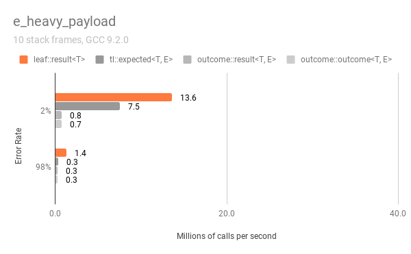
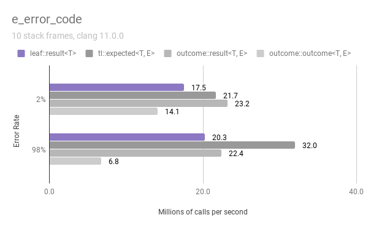
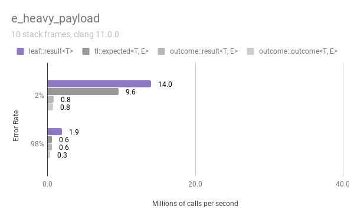

# Benchmark

The LEAF github repository contains two similar benchmarking programs, one using LEAF, the other configurable to use `tl::expected` or Boost Outcome, that simulate transporting error objects across 10 levels of stack frames, measuring the performance of the three libraries.

Links:
* LEAF: https://zajo.github.io/leaf
* `tl::expected`: https://github.com/TartanLlama/expected
* Boost Outcome V2: https://www.boost.org/doc/libs/release/libs/outcome/doc/html/index.html

## Library design considerations

LEAF serves a similar purpose to other error handling libraries, but its design is very different. The benchmarks are comparing apples and oranges.

The main design difference is that when using LEAF, error objects are not communicated in return values. In case of a failure, the `leaf::result<T>` object transports only an `int`, the unique error ID.

Error objects skip the error-neutral functions in the call stack and get moved directly to the relevant error-handling scope. This mechanism does not depend on RVO or any other optimization: as soon as the program passes an error object to LEAF, it moves it to the correct error handling scope.

Other error-handling libraries instead couple the static type of the return value of *all* error-neutral functions with the error type an error-reporting function may return. This approach suffers from the same problems as statically-enforced exception specifications:

* It's difficult or impossible to use in generic contexts, and
* It  impedes interoperability between the many different error types a non-trivial program must deal with.

(The Boost Outcome library is also capable of avoiding such excessive coupling, by passing for the third `P` argument in the `outcome<T, E, P>` template a pointer that erases the exact static type of the object being transported. However, this would require a dynamic memory allocation).

## Syntax

The most common check-only use case looks almost identically in LEAF and in Boost Outcome (`tl::expected` lacks a similar macro):

```c++
// Outcome
{
	BOOST_OUTCOME_TRY(v, f()); // Check for errors, forward failures to the caller
	// If control reaches here, v is the successful result (the call succeeded).
}
```

```c++
// LEAF
{
	LEAF_AUTO(v, f()); // Check for errors, forward failures to the caller
	// If control reaches here, v is the successful result (the call succeeded).
}
```

However, when we want to handle failures, in Boost Outcome and in `tl::expected`, accessing the error object (which is always stored in the return value) is a simple continuation of the error check:

```c++
// Outcome, tl::expected
if( auto r = f() )
	return r.value()+1; // No error
else
{	// Error!
	switch( r.error() )
	{
	error_enum::error1:
		/* handle error_enum::error1 */
		break;

	error_enum::error2:
		/* handle error_enum::error2 */
		break;

	default:
		/* handle any other failure */
	}
}
```

When using LEAF, we must explicitly state our intention to handle errors, not just check for failures:

```c++
// LEAF
leaf::try_handle_all
	[]() -> leaf::result<T>
	{
		LEAF_AUTO(v, f());
		// No error, use v
	},
	[]( leaf::match<error_enum, error_enum::error1> )
	{
		/* handle error_enum::error1 */
	},
	[]( leaf::match<error_enum, error_enum::error2> )
	{
		/* handle error_enum::error2 */
	},
	[]()
	{
		/* handle any other failure */
	} );
```

The use of `try_handle_all` reserves storage on the stack for the error object types being handled (in this case, `error_enum`). If the failure is either `error_enum::error1` or `error_enum::error2`, the matching error handling lambda is invoked.

## Code generation considerations

Benchmarking C++ programs is tricky, because we want to prevent the compiler from optimizing out things it shouldn't normally be able to optimize in a real program, yet we don't want to interfere with "legitimate" optimizations.

The primary approach we use to prevent the compiler from optimizing everything out to nothing is to base all computations on a call to `std::rand()`. This adds cycles, but it also makes the benchmark more realistic, since functions which may legitimately fail should do _some_ real work.

When benchmarking error handling, it makes sense to measure the time it takes to return a result or error across multiple stack frames. This calls for disabling inlining.

The technique used to disable inlining in this benchmark is to mark functions as `__attribute__((noinline))`. This is imperfect, because optimizers can still peek into the body of the function and optimize things out, as is seen in this example:

```c++
__attribute__((noinline)) int val() {return 42;}

int main() {
    return val();
}
```

Which on clang 9 outputs:

```x86asm
val():
	mov     eax, 42
	ret
main:
	mov     eax, 42
	ret
```

It does not appear that anything like this is occurring in our case, but it is still a possibility.

> NOTES:
>
> - The benchmarks are compiled with exception handling disabled.
> - LEAF is able to work with external `result<>` types. The benchmark uses `leaf::result<T>`.

## Show me the code!

The following source:

```C++
leaf::result<int> f();

leaf::result<int> g()
{
    LEAF_AUTO(x, f());
    return x+1;
}
```

Generates this code on clang ([Godbolt](https://godbolt.org/z/4AtHMk)):

```x86asm
g():                                  # @g()
	push    rbx
	sub     rsp, 32
	mov     rbx, rdi
	lea     rdi, [rsp + 8]
	call    f()
	mov     eax, dword ptr [rsp + 8]
	mov     ecx, eax
	and     ecx, 3
	cmp     ecx, 2
	je      .LBB0_4
	cmp     ecx, 3
	jne     .LBB0_2
	mov     eax, dword ptr [rsp + 16]
	add     eax, 1
	mov     dword ptr [rbx], 3
	mov     dword ptr [rbx + 8], eax
	mov     rax, rbx
	add     rsp, 32
	pop     rbx
	ret
.LBB0_4:
	mov     dword ptr [rbx], 2
	movups  xmm0, xmmword ptr [rsp + 16]
	mov     qword ptr [rsp + 24], 0
	movups  xmmword ptr [rbx + 8], xmm0
	mov     qword ptr [rsp + 16], 0
	mov     rax, rbx
	add     rsp, 32
	pop     rbx
	ret
.LBB0_2:
	mov     dword ptr [rbx], eax
	mov     rax, rbx
	add     rsp, 32
	pop     rbx
	ret
```

> Description:
>
> * The default no-jump path is the happy path (ends at the first `ret`); the returned `result<T>` holds the `int` discriminant and the `T` (`int` in this case).
>
> * `.LBB0_2`: Regular failure; the returned `result<T>` object holds only the `int` discriminant.
>
> * `.LBB0_4`: Failure; the returned `result<T>` holds the `int` discriminant and a `std::shared_ptr<leaf::polymorphic_context>` (used to hold error objects transported from another thread).

Note that `f` is undefined, hence the `call` instruction. Predictably, if we provide a trivial definition for `f`:

```C++
leaf::result<int> f()
{
    return 42;
}

leaf::result<int> g()
{
    LEAF_AUTO(x, f());
    return x+1;
}
```

We get:

```x86asm
g():                                  # @g()
	mov     rax, rdi
	mov     dword ptr [rdi], 3
	mov     dword ptr [rdi + 8], 43
	ret
```

With a less trivial definition of `f`:

```C++
leaf::result<int> f()
{
    if( rand()%2 )
	return 42;
    else
	return leaf::new_error();
}

leaf::result<int> g()
{
    LEAF_AUTO(x, f());
    return x+1;
}
```

We get ([Godbolt](https://godbolt.org/z/4P7Jvv)):

```x86asm
g():                                  # @g()
	push    rbx
	mov     rbx, rdi
	call    rand
	test    al, 1
	jne     .LBB1_5
	mov     eax, dword ptr fs:[boost::leaf::leaf_detail::id_factory<void>::next_id@TPOFF]
	test    eax, eax
	je      .LBB1_3
	mov     dword ptr fs:[boost::leaf::leaf_detail::id_factory<void>::next_id@TPOFF], 0
	jmp     .LBB1_4
.LBB1_5:
	mov     dword ptr [rbx], 3
	mov     dword ptr [rbx + 8], 43
	mov     rax, rbx
	pop     rbx
	ret
.LBB1_3:
	mov     eax, 4
	lock            xadd    dword ptr [rip + boost::leaf::leaf_detail::id_factory<void>::counter], eax
	add     eax, 4
.LBB1_4:
	and     eax, -4
	or      eax, 1
	mov     dword ptr fs:[boost::leaf::leaf_detail::id_factory<void>::last_id@TPOFF], eax
	mov     dword ptr [rbx], eax
	mov     rax, rbx
	pop     rbx
	ret
```

Above, the call to `f()` is inlined, most of the code is from the initial error reporting machinery in LEAF.

## Benchmark matrix dimensions

The benchmark matrix has 2 dimensions:

1. Error object type:

	a. The error object transported in case of a failure is of type `e_error_code`, which is a simple `enum`.

	b. The error object transported in case of a failure is of type `struct e_system_error { e_error_code value; std::string what; }`.

	c. The error object transported in case of a failure is of type `e_heavy_payload`, a `struct` of size 4096.

2. Error rate: 2%, 98%

## Source code

[deep_stack_leaf.cpp](deep_stack_leaf.cpp)

[deep_stack_other.cpp](deep_stack_other.cpp)

## Godbolt

Godbolt has built-in support for Boost (Outcome), but LEAF and `tl::expected` both provide a single header, which makes it very easy to use them online as well. To see the generated code for the benchmark program, you can copy and paste the following into Godbolt:

`leaf::result<T>` (https://godbolt.org/z/DTk4N4):

```c++
#include "https://raw.githubusercontent.com/zajo/leaf/master/include/boost/leaf/all.hpp"
#include "https://raw.githubusercontent.com/zajo/leaf/master/benchmark/> deep_stack_leaf.cpp"
```

`tl::expected<T, E>` (https://godbolt.org/z/GDB43h):

```c++
#include "https://raw.githubusercontent.com/TartanLlama/expected/master/include/tl/expected.hpp"
#include "https://raw.githubusercontent.com/zajo/leaf/master/benchmark/> deep_stack_other.cpp"
```

`outcome::result<T, E>` (https://godbolt.org/z/-tqHfN):

```c++
#define BENCHMARK_WHAT 1
#include "https://raw.githubusercontent.com/zajo/leaf/master/benchmark/deep_stack_other.cpp"
```

## Build options

To build both versions of the benchmark program, the compilers are invoked using the following command line options:

* `-std=c++17`: Required by other libraries (LEAF only requires C++11);
* `-fno-exceptions`: Disable exception handling;
* `-O3`: Maximum optimizations;
* `-DNDEBUG`: Disable asserts.

In addition, the LEAF version is compiled with:

* `-DLEAF_DIAGNOSTICS=0`: Disable diagnostic information for error objects not recognized by the program. This is a debugging feature, see [Configuration Macros](https://zajo.github.io/leaf/#_configuration_macros).

## Results

Below is the output the benchmark programs running on a MacBook Pro. The tables show the elapsed time for 10,000 iterations of returning a result across 10 stack frames, depending on the error type and the rate of failures. In addition, the programs generate a `benchmark.csv` file in the current working directory.

### gcc:

`leaf::result<T>`:

Error type      |  2% (?s) | 98% (?s)
----------------|---------:|--------:
e_error_code    |      692 |      543
e_system_error  |      676 |     1198
e_heavy_payload |      898 |     6927

`tl::expected<T, E>`:

Error type      |  2% (?s) | 98% (?s)
----------------|---------:|--------:
e_error_code    |     1204 |      870
e_system_error  |      871 |     5804
e_heavy_payload |     1113 |    22361

`outcome::result<T, E>`:

Error type      |  2% (?s) | 98% (?s)
----------------|---------:|--------:
e_error_code    |     1249 |      846
e_system_error  |      746 |     1331
e_heavy_payload |    10516 |    24120

`outcome::outcome<T, E>`:

Error type      |  2% (?s) | 98% (?s)
----------------|---------:|--------:
e_error_code    |      825 |     1267
e_system_error  |     1009 |     2528
e_heavy_payload |    10439 |    26361

### clang:

`leaf::result<T>`:

Error type      |  2% (?s) | 98% (?s)
----------------|---------:|--------:
e_error_code    |      613 |      485
e_system_error  |      629 |      993
e_heavy_payload |      754 |     4641

`tl::expected<T, E>`:

Error type      |  2% (?s) | 98% (?s)
----------------|---------:|--------:
e_error_code    |      817 |      489
e_system_error  |      936 |     3907
e_heavy_payload |     1202 |    13909

`outcome::result<T, E>`:

Error type      |  2% (?s) | 98% (?s)
----------------|---------:|--------:
e_error_code    |      664 |      662
e_system_error  |      735 |     1815
e_heavy_payload |     9925 |    14216

`outcome::outcome<T, E>`:

Error type      |  2% (?s) | 98% (?s)
----------------|---------:|--------:
e_error_code    |     1009 |     2232
e_system_error  |      874 |     2588
e_heavy_payload |     9803 |    21218

## Charts

The charts below are generated from the results from the previous section, converted from elapsed time in microseconds to millions of calls per second.

### gcc:




### clang:






## Thanks

Thanks for the valuable feedback: Peter Dimov, Glen Fernandes, Sorin Fetche, Niall Douglas, Ben Craig, Vinnie Falco, Jason Dictos
